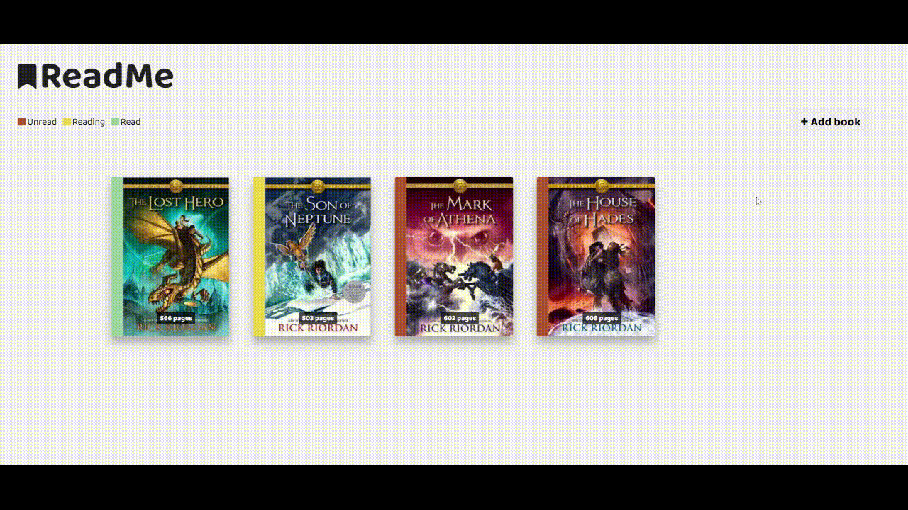

# Library

A book tracking app where you can add books to your read list.

## Live preview

https://hairalei.github.io/ReadMe/

## Features

- Search books using API and add them to the library/list
- Delete book from library
- Switch reading status from 'Unread' to 'Reading' to 'Read'
- Group books by reading status
- Save details to your local storage
